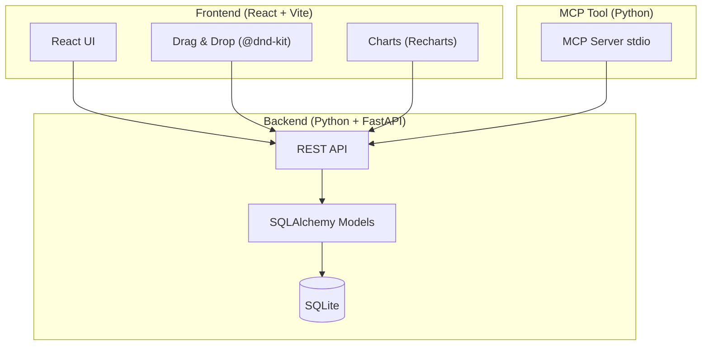
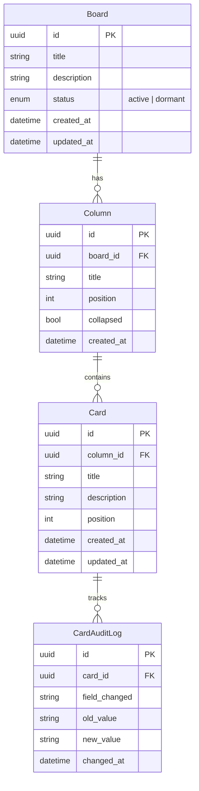

# Kanban Board Application — Implementation Plan

A full-stack Kanban board management application with a **React** frontend, **Python (FastAPI)** backend, and an **MCP tool** that exposes the API for agentic control.

## User Review Required

> [!IMPORTANT]
> **Database choice**: The plan uses **SQLite** via `aiosqlite` for simplicity. If you prefer PostgreSQL or another database, let me know before execution.

> [!IMPORTANT]
> **Authentication**: No authentication layer is included in v1. If you need user/auth support, I can add it to the plan.

> [!WARNING]
> **Drag & drop library**: The plan uses `@dnd-kit/core` (modern, maintained). An alternative is `react-beautiful-dnd` (deprecated but stable). Confirm preference.

---

## Architecture Overview



---

## Data Model



---

## Proposed Changes

### Backend (`backend/`)

#### [NEW] [pyproject.toml](file:///Users/jmunozal/projects/kanban-board/backend/pyproject.toml)

Python project manifest using `uv`. Dependencies: `fastapi`, `uvicorn`, `sqlalchemy`, `aiosqlite`, `alembic`, `pydantic`.

#### [NEW] [main.py](file:///Users/jmunozal/projects/kanban-board/backend/app/main.py)

FastAPI entry point. Registers routers, CORS middleware, lifespan events for DB init.

#### [NEW] [database.py](file:///Users/jmunozal/projects/kanban-board/backend/app/database.py)

Async SQLAlchemy engine, session factory, and `Base` declarative base.

#### [NEW] [models.py](file:///Users/jmunozal/projects/kanban-board/backend/app/models.py)

SQLAlchemy ORM models: `Board`, `Column`, `Card`, `CardAuditLog`.

#### [NEW] [schemas.py](file:///Users/jmunozal/projects/kanban-board/backend/app/schemas.py)

Pydantic v2 schemas for request/response validation of all entities.

#### [NEW] [routers/boards.py](file:///Users/jmunozal/projects/kanban-board/backend/app/routers/boards.py)

Endpoints:

| Method | Path | Description |
|--------|------|-------------|
| `GET` | `/boards` | List all boards (filter by status) |
| `POST` | `/boards` | Create board (with default columns) |
| `GET` | `/boards/{id}` | Get board detail with columns & cards |
| `PUT` | `/boards/{id}` | Update board (title, description, status) |
| `DELETE` | `/boards/{id}` | Soft/hard delete board |
| `GET` | `/boards/{id}/dashboard` | Atomic dashboard for a board |

#### [NEW] [routers/columns.py](file:///Users/jmunozal/projects/kanban-board/backend/app/routers/columns.py)

Endpoints:

| Method | Path | Description |
|--------|------|-------------|
| `POST` | `/boards/{id}/columns` | Add column |
| `PUT` | `/columns/{id}` | Update column (title, position, collapsed) |
| `DELETE` | `/columns/{id}` | Delete column |
| `PUT` | `/columns/reorder` | Reorder columns |

#### [NEW] [routers/cards.py](file:///Users/jmunozal/projects/kanban-board/backend/app/routers/cards.py)

Endpoints:

| Method | Path | Description |
|--------|------|-------------|
| `POST` | `/columns/{id}/cards` | Create card |
| `GET` | `/cards/{id}` | Get card with audit trail |
| `PUT` | `/cards/{id}` | Update card |
| `PUT` | `/cards/{id}/move` | Move card to another column |
| `DELETE` | `/cards/{id}` | Delete card |

#### [NEW] [routers/dashboard.py](file:///Users/jmunozal/projects/kanban-board/backend/app/routers/dashboard.py)

Endpoints:

| Method | Path | Description |
|--------|------|-------------|
| `GET` | `/dashboard` | General dashboard (all active boards) |
| `GET` | `/dashboard/global-board` | Global board view — all cards grouped by column title |

#### [NEW] [tests/](file:///Users/jmunozal/projects/kanban-board/backend/tests/)

- `test_boards.py` — Board CRUD + status transitions
- `test_columns.py` — Column CRUD + reorder
- `test_cards.py` — Card CRUD + move + audit log
- `test_dashboard.py` — Dashboard aggregation

---

### Frontend (`frontend/`)

#### [NEW] [package.json](file:///Users/jmunozal/projects/kanban-board/frontend/package.json)

Vite + React project. Key dependencies: `react-router-dom`, `@dnd-kit/core`, `@dnd-kit/sortable`, `recharts`, `axios`.

#### [NEW] [src/App.jsx](file:///Users/jmunozal/projects/kanban-board/frontend/src/App.jsx)

Root component with routing: `/` → Board List, `/board/:id` → Board Detail, `/global` → Global Board, `/dashboard` → General Dashboard.

#### [NEW] [src/styles/index.css](file:///Users/jmunozal/projects/kanban-board/frontend/src/styles/index.css)

Design system with CSS custom properties, dark theme, glassmorphism effects, typography (Inter font).

#### [NEW] [src/services/api.js](file:///Users/jmunozal/projects/kanban-board/frontend/src/services/api.js)

Axios client wrapping all backend endpoints.

#### [NEW] [src/pages/BoardListPage.jsx](file:///Users/jmunozal/projects/kanban-board/frontend/src/pages/BoardListPage.jsx)

Lists boards with active/dormant filter, create/delete actions.

#### [NEW] [src/pages/BoardDetailPage.jsx](file:///Users/jmunozal/projects/kanban-board/frontend/src/pages/BoardDetailPage.jsx)

Board view with columns, drag & drop cards, column collapse.

#### [NEW] [src/pages/DashboardPage.jsx](file:///Users/jmunozal/projects/kanban-board/frontend/src/pages/DashboardPage.jsx)

General dashboard with charts for all active boards.

#### [NEW] [src/components/](file:///Users/jmunozal/projects/kanban-board/frontend/src/components/)

- `BoardCard.jsx` — Board card in list view
- `Column.jsx` — Kanban column (collapsible, color-coded header)
- `CardItem.jsx` — Card inside a column (color-coded left border)
- `CardDetailModal.jsx` — Card edit + audit trail
- `BoardDashboard.jsx` — Atomic dashboard charts
- `CreateBoardModal.jsx` — Board creation form
- `CreateCardModal.jsx` — Card creation form

#### [NEW] [src/pages/GlobalBoardPage.jsx](file:///Users/jmunozal/projects/kanban-board/frontend/src/pages/GlobalBoardPage.jsx)

Global kanban view showing all cards from active boards grouped by column type. Clicking a card navigates to its board.

#### [NEW] [src/services/columnColors.js](file:///Users/jmunozal/projects/kanban-board/frontend/src/services/columnColors.js)

Centralized color mapping for column types: purple=Backlog, blue=WIP, green=Done, red=Stopped, gray=Archive.

---

### MCP Tool (`mcp-tool/`)

#### [NEW] [pyproject.toml](file:///Users/jmunozal/projects/kanban-board/mcp-tool/pyproject.toml)

Dependencies: `mcp`, `httpx`.

#### [NEW] [server.py](file:///Users/jmunozal/projects/kanban-board/mcp-tool/kanban_mcp/server.py)

MCP server (stdio transport) exposing tools:

| Tool | Description |
|------|-------------|
| `list_boards` | List boards with optional status filter |
| `create_board` | Create a new board |
| `get_board` | Get board detail |
| `update_board` | Update board (title/description/status) |
| `delete_board` | Delete a board |
| `create_card` | Create a card in a column |
| `move_card` | Move a card between columns |
| `update_card` | Update card fields |
| `delete_card` | Delete a card |
| `get_card_audit` | Get audit trail for a card |
| `manage_columns` | Add/update/delete/reorder columns |
| `get_board_dashboard` | Get atomic board dashboard |
| `get_general_dashboard` | Get general dashboard |

#### [NEW] [tests/test_tools.py](file:///Users/jmunozal/projects/kanban-board/mcp-tool/tests/test_tools.py)

Tests for each MCP tool against a running backend instance.

---

### Project Root

#### [NEW] [README.md](file:///Users/jmunozal/projects/kanban-board/README.md)

High-level project overview, setup instructions, architecture diagram.

---

## Verification Plan

### Automated Tests

**Backend (pytest)**

```bash
cd /Users/jmunozal/projects/kanban-board/backend
uv run pytest tests/ -v
```

- Tests use an in-memory SQLite database
- Cover all CRUD operations, card movement, audit log generation, and dashboard aggregation

**MCP Tool**

```bash
cd /Users/jmunozal/projects/kanban-board/mcp-tool
uv run pytest tests/ -v
```

### Browser Verification

1. Start backend: `cd backend && uv run uvicorn app.main:app --reload`
2. Start frontend: `cd frontend && npm run dev`
3. Open browser and verify:
   - Create a board → columns auto-created
   - Add cards → drag between columns
   - Collapse/expand columns
   - Toggle board active/dormant
   - Delete board/card
   - View board dashboard with charts
   - View general dashboard
   - View global board (all cards across boards grouped by column)
   - Verify card borders change color by column

### Manual Verification

- Verify MCP tool works with an MCP client (e.g. Claude Desktop or `mcp dev`)
- Confirm audit trail entries are created on every card state change
