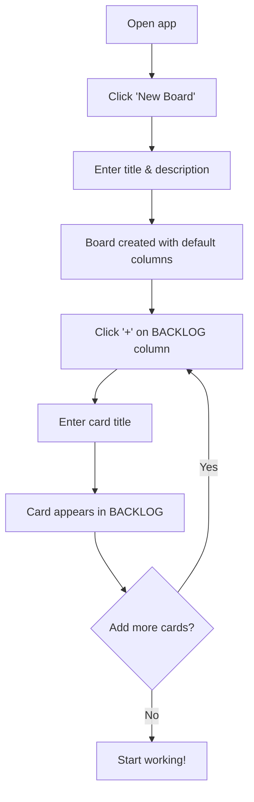
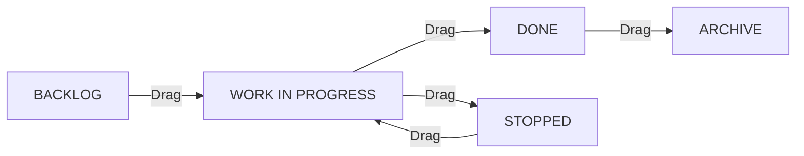
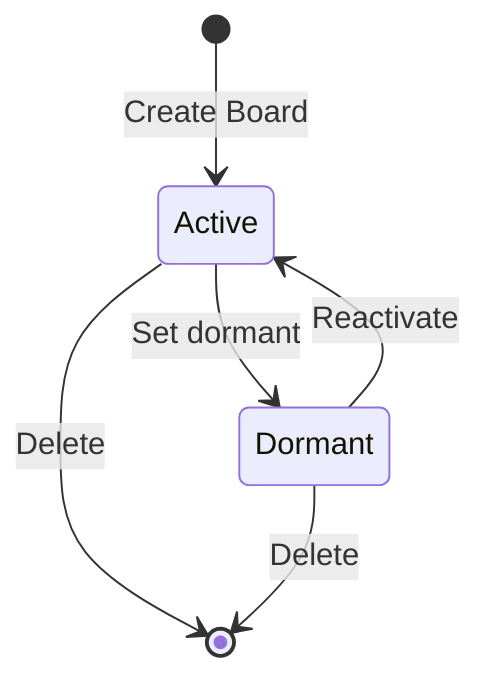

# Kanban Board — Product Documentation

## 1. Vision

A lightweight, self-hosted Kanban board application that enables individuals and small teams to visually manage their work across multiple projects. It provides drag-and-drop card management, customizable workflows, full audit trails, and real-time dashboards — all controllable via both a web UI and an AI-powered MCP tool.

---

## 2. Key Features

### 2.1 Board Management

- **Multiple boards** — organize work by project, team, or context
- **Status control** — boards can be **active** (visible in dashboards) or **dormant** (hidden, preserved)
- **Deletable** — permanently remove boards that are no longer needed

### 2.2 Customizable Columns

- Each board has its own set of columns representing workflow stages
- **Default template**: `BACKLOG → WORK IN PROGRESS → DONE → STOPPED → ARCHIVE`
- Columns can be **added**, **renamed**, **reordered**, or **removed**
- Columns can be **collapsed** to reduce visual noise and focus on active work

### 2.3 Card Management

- Cards represent individual tasks or work items
- Drag and drop cards between columns to update their status
- Drag and drop cards within the same column to reorder (up/down)
- Edit card title and description inline
- Delete cards that are no longer relevant

### 2.4 Audit Trail

- Every state change on a card is automatically recorded
- The audit trail captures: what field changed, old value, new value, and when
- View the complete history of a card from its detail panel

### 2.5 Dashboards

#### Board Dashboard (Atomic)

Each board has its own analytics view showing:

- Total card count and distribution per column
- Recent activity feed
- Cards created vs. completed over time

#### General Dashboard

A unified view across all active boards:

- Number of active boards
- Total cards in the system
- Per-board summary (total, done, in-progress)
- Global card distribution across column types

#### Global Board View

A read-only kanban view aggregating all cards from every active board:

- Cards grouped by column type (BACKLOG, WIP, DONE, STOPPED, ARCHIVE)
- Each card shows its parent board name
- Click a card to navigate to its board

### 2.6 Visual Design

- **Column color coding** — each column type has a distinct accent color (purple for Backlog, blue for WIP, green for Done, red for Stopped, gray for Archive)
- Card left borders and column headers reflect their column color
- Dark theme with glassmorphism and micro-animations

### 2.7 MCP Tool (AI Integration)

- All features available via a command-line MCP tool
- Allows AI agents (e.g., Claude) to create boards, manage cards, and query dashboards programmatically

---

## 3. User Stories

| ID | As a… | I want to… | So that… |
|----|-------|-----------|----------|
| US-01 | User | Create a new board | I can organize a new project |
| US-02 | User | See all my boards | I can find and navigate to any project |
| US-03 | User | Mark a board as dormant | Inactive projects stop cluttering my view |
| US-04 | User | Reactivate a dormant board | I can resume work on paused projects |
| US-05 | User | Delete a board | I can clean up projects no longer needed |
| US-06 | User | Add a card to a column | I can track a new task |
| US-07 | User | Drag a card to another column | I can update a task's progress visually |
| US-08 | User | Edit a card | I can refine task details |
| US-09 | User | Delete a card | I can remove irrelevant tasks |
| US-10 | User | See a card's audit trail | I can understand how a task evolved |
| US-11 | User | Customize columns | The workflow matches my process |
| US-12 | User | Collapse a column | I can focus on the columns that matter |
| US-13 | User | View board analytics | I can assess a project's health |
| US-14 | User | View overall analytics | I can get a birds-eye view of all work |
| US-15 | User | See all cards across boards in one view | I can get a global picture of all tasks |
| US-16 | User | See color-coded columns | I can quickly identify card statuses visually |
| US-17 | AI Agent | Control boards via MCP | I can automate Kanban management |

---

## 4. User Flows

### 4.1 Create Board & Add First Cards

### 4.2 Move Card Through Workflow

Each move generates an audit log entry automatically.

### 4.3 Manage Board Lifecycle

---

## 5. Success Metrics

| Metric | Target |
|--------|--------|
| Board creation to first card | < 30 seconds |
| Card drag response time | < 200ms |
| Dashboard load time | < 1 second |
| Audit trail completeness | 100% of card changes tracked |
| MCP tool coverage | All API operations available |

---

## 6. Out of Scope (v1)

- User authentication and multi-user collaboration
- Real-time WebSocket updates
- File attachments on cards
- Labels / tags on cards
- Due dates and reminders
- Keyboard shortcuts
- Mobile-optimized layout

> [!NOTE]
> These features can be added in future iterations based on user feedback.
