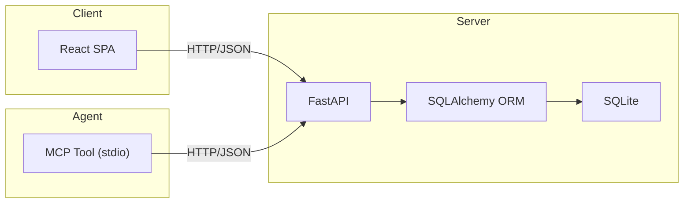
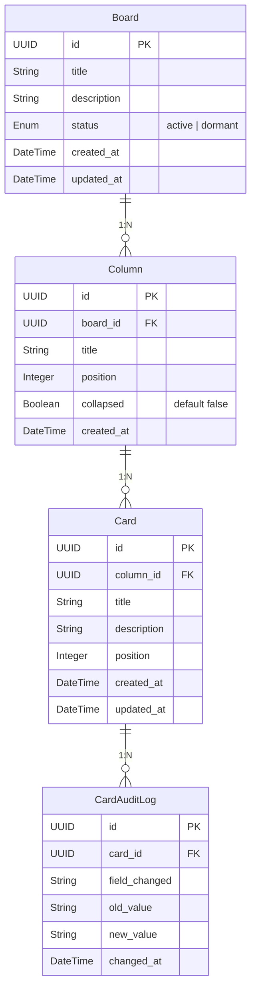
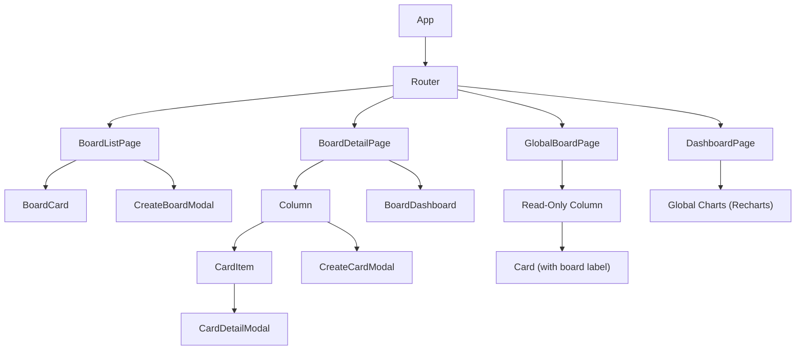

# Kanban Board — Technical Documentation

## 1. Architecture



| Layer | Technology | Purpose |
|-------|-----------|---------|
| Frontend | React 18 + Vite | SPA, drag-and-drop, charts |
| Backend | FastAPI + SQLAlchemy | REST API, ORM, async I/O |
| Database | SQLite (aiosqlite) | Persistence |
| MCP Tool | Python MCP SDK | Agentic control via stdio |

---

## 2. Data Model

### 2.1 Entities



### 2.2 Default Column Template

When a board is created, these columns are provisioned automatically:

| Position | Title | Purpose |
|----------|-------|---------|
| 0 | BACKLOG | Items not yet started |
| 1 | WORK IN PROGRESS | Actively being worked on |
| 2 | DONE | Completed items |
| 3 | STOPPED | Blocked or paused |
| 4 | ARCHIVE | Historical items |

### 2.3 Audit Trail

Every change to a `Card`'s mutable fields (`title`, `description`, `column_id`, `position`) generates a `CardAuditLog` entry with:

- **field_changed**: name of the field
- **old_value / new_value**: serialized previous and new values
- **changed_at**: UTC timestamp

---

## 3. REST API Specification

### 3.1 Boards

| Method | Endpoint | Body | Response | Description |
|--------|----------|------|----------|-------------|
| `GET` | `/api/boards` | — | `Board[]` | List boards. Query: `?status=active\|dormant` |
| `POST` | `/api/boards` | `{title, description?}` | `Board` | Create board + default columns |
| `GET` | `/api/boards/{id}` | — | `Board` (full) | Board with columns and cards |
| `PUT` | `/api/boards/{id}` | `{title?, description?, status?}` | `Board` | Update board |
| `DELETE` | `/api/boards/{id}` | — | `204` | Delete board and cascade |
| `GET` | `/api/boards/{id}/dashboard` | — | `BoardDashboard` | Atomic dashboard |

### 3.2 Columns

| Method | Endpoint | Body | Response | Description |
|--------|----------|------|----------|-------------|
| `POST` | `/api/boards/{id}/columns` | `{title, position?}` | `Column` | Add column |
| `PUT` | `/api/columns/{id}` | `{title?, position?, collapsed?}` | `Column` | Update column |
| `DELETE` | `/api/columns/{id}` | — | `204` | Delete column |
| `PUT` | `/api/columns/reorder` | `{column_ids: []}` | `Column[]` | Reorder columns |

### 3.3 Cards

| Method | Endpoint | Body | Response | Description |
|--------|----------|------|----------|-------------|
| `POST` | `/api/columns/{id}/cards` | `{title, description?}` | `Card` | Create card |
| `GET` | `/api/cards/{id}` | — | `Card` + audit | Card with audit log |
| `PUT` | `/api/cards/{id}` | `{title?, description?}` | `Card` | Update card |
| `PUT` | `/api/cards/{id}/move` | `{column_id, position}` | `Card` | Move card to column/position, shifting others |
| `DELETE` | `/api/cards/{id}` | — | `204` | Delete card |

### 3.4 Dashboard

| Method | Endpoint | Response | Description |
|--------|----------|----------|-------------|
| `GET` | `/api/dashboard` | `GeneralDashboard` | Aggregated stats for all active boards |
| `GET` | `/api/dashboard/global-board` | `GlobalBoard` | All cards from active boards grouped by column title |

### 3.5 Dashboard Response Shapes

**BoardDashboard**

```json
{
  "board_id": "uuid",
  "total_cards": 42,
  "cards_per_column": { "BACKLOG": 10, "WIP": 15, ... },
  "recent_activity": [ { "card_title": "...", "action": "moved", "timestamp": "..." } ],
  "created_vs_completed": { "created": 5, "completed": 3, "period": "7d" }
}
```

**GeneralDashboard**

```json
{
  "active_boards": 4,
  "total_cards": 128,
  "boards_summary": [
    { "board_id": "...", "title": "...", "total": 32, "done": 12, "wip": 8 }
  ],
  "global_distribution": { "BACKLOG": 40, "WIP": 30, ... }
}
```

---

## 4. Frontend Component Tree



### Key Behaviors

- **Drag & Drop**: `@dnd-kit` — cards draggable between columns and reorderable within the same column (up/down)
- **Position management**: Backend automatically shifts other cards' positions when a card is moved or reordered
- **Column collapse**: click header chevron → hides card list, shows card count badge
- **Column color coding**: each column type has a distinct accent color (purple, blue, green, red, gray) applied to column headers and card left borders
- **Audit trail**: `CardDetailModal` shows timestamped change log
- **Global Board**: read-only kanban showing all cards across active boards, grouped by column type

---

## 5. MCP Tool Catalog

| Tool Name | Parameters | Returns |
|-----------|-----------|---------|
| `list_boards` | `status?: "active" \| "dormant"` | Board list |
| `create_board` | `title, description?` | Board |
| `get_board` | `board_id` | Board (full) |
| `update_board` | `board_id, title?, description?, status?` | Board |
| `delete_board` | `board_id` | confirmation |
| `create_card` | `column_id, title, description?` | Card |
| `update_card` | `card_id, title?, description?` | Card |
| `move_card` | `card_id, target_column_id, position?` | Card |
| `delete_card` | `card_id` | confirmation |
| `get_card_audit` | `card_id` | AuditLog[] |
| `manage_columns` | `action, board_id?, column_id?, ...` | Column |
| `get_board_dashboard` | `board_id` | BoardDashboard |
| `get_general_dashboard` | — | GeneralDashboard |

---

## 6. Project Structure

```
kanban-board/
├── backend/
│   ├── pyproject.toml
│   ├── alembic/
│   ├── app/
│   │   ├── __init__.py
│   │   ├── main.py
│   │   ├── database.py
│   │   ├── models.py
│   │   ├── schemas.py
│   │   └── routers/
│   │       ├── boards.py
│   │       ├── columns.py
│   │       ├── cards.py
│   │       └── dashboard.py
│   └── tests/
│       ├── conftest.py
│       ├── test_boards.py
│       ├── test_columns.py
│       ├── test_cards.py
│       └── test_dashboard.py
├── frontend/
│   ├── package.json
│   ├── vite.config.js
│   ├── index.html
│   └── src/
│       ├── App.jsx
│       ├── main.jsx
│       ├── styles/
│       │   └── index.css
│       ├── services/
│       │   ├── api.js
│       │   └── columnColors.js
│       ├── pages/
│       │   ├── BoardListPage.jsx
│       │   ├── BoardDetailPage.jsx
│       │   ├── GlobalBoardPage.jsx
│       │   └── DashboardPage.jsx
│       └── components/
│           ├── BoardCard.jsx
│           ├── Column.jsx
│           ├── CardItem.jsx
│           ├── CardDetailModal.jsx
│           ├── BoardDashboard.jsx
│           ├── CreateBoardModal.jsx
│           └── CreateCardModal.jsx
├── mcp-tool/
│   ├── pyproject.toml
│   ├── kanban_mcp/
│   │   ├── __init__.py
│   │   └── server.py
│   └── tests/
│       └── test_tools.py
└── README.md
```
